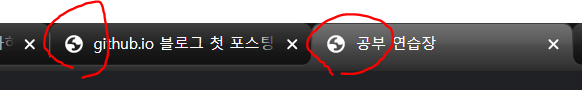
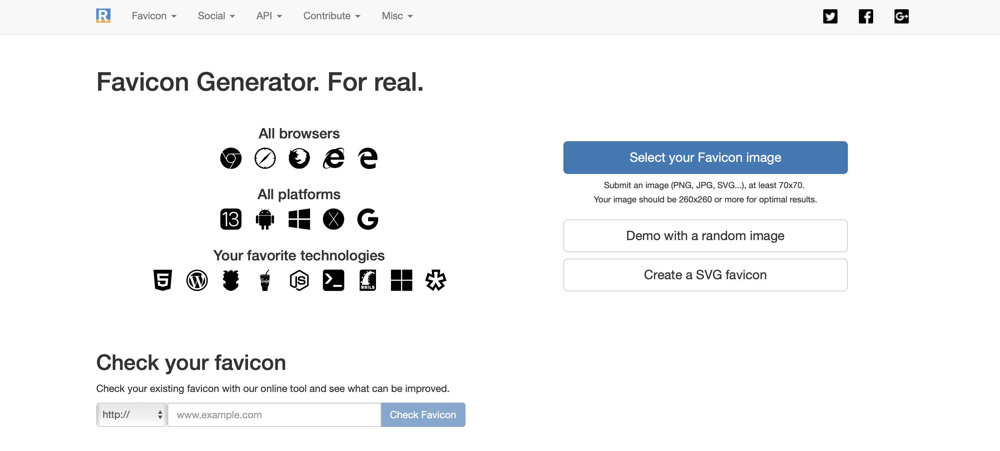
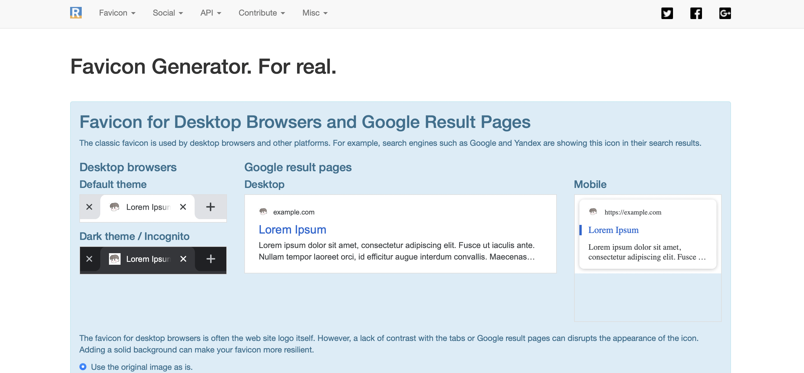
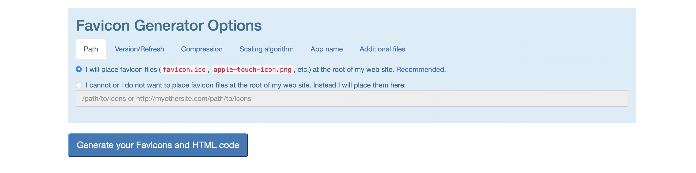
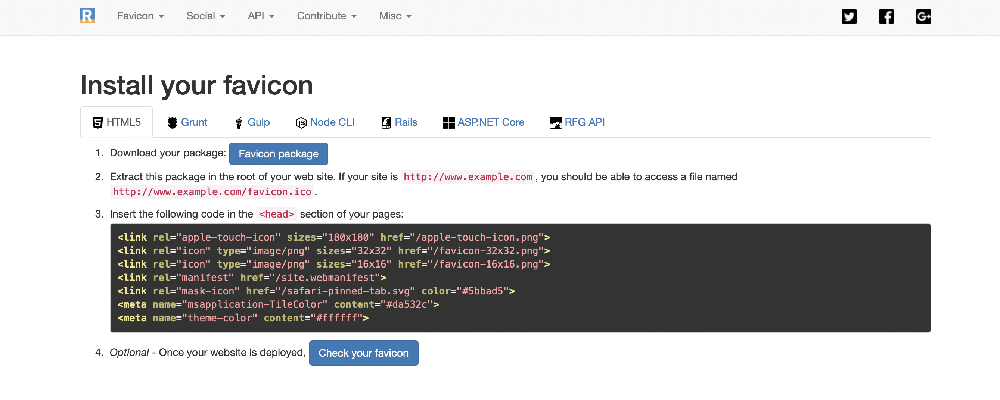
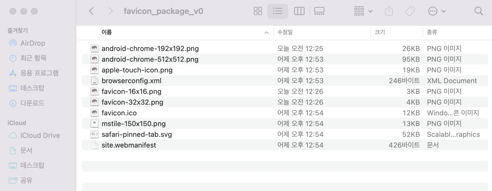
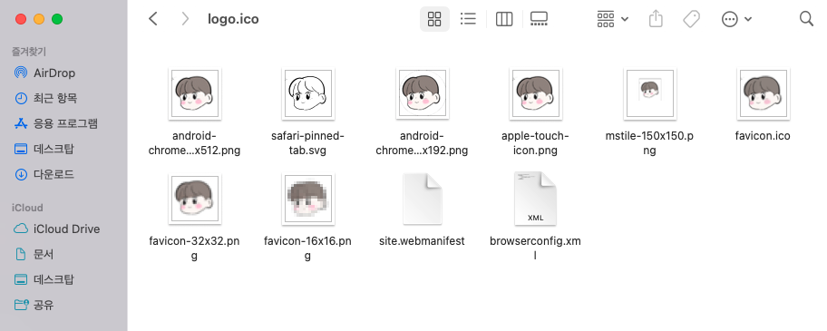
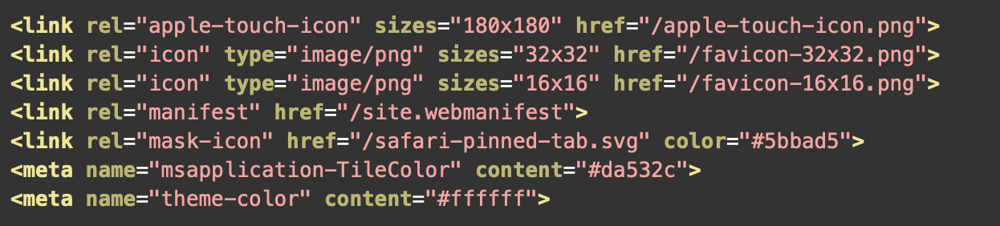
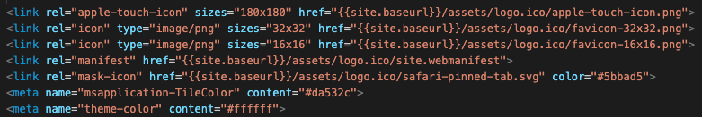

## Github blog에 favicon 적용하기

favicon은 브라우저의 탭에 위치해있는 이미지를 의미합니다. 

favicon을 특별히 지정하지 않으면, 다음과 같이 지구본 모양을 띄게 됩니다.  
favicon을 바꾸는 방법에 대해 알아보도록 하겠습니다.  
  
  <h2> 1. 적절한 이미지 준비하기 </h2>
  저는 다음 이미지로 해보도록 하겠습니다.  
  
  
  <h2> 2. 이미지 파일 사이트에 업로드하기 </h2>
  [realfavicongenerator](https://realfavicongenerator.net) 사이트에 접속하여  
  Select your Favicon image를 누르고 파일을 업로드 합니다.  
   
  

  다음 페이지에서는 원하는 이미지가 favicon으로 적용됐을 때 어떻게 보이는지 알려줍니다.  
  
   
    
  <h2> 3. 가공된 이미지 파일 다운받기 </h2>
   
  
  페이지 하단에 위치한 Generate your Favicons and HTML code를 누르고 다음 페이지의 Favicon package를 눌러 zip 파일을 다운로드 합니다.  
   
  
  <h2> 4. asset 폴더 내에 logo 폴더 만들어서 붙여넣기 </h2>
    
   
  다운로드한 파일 속에 있는 이미지들을 전부 복사하여  
  github.io 속 asset 폴더에 새로 logo.ico 폴더를 생성하고 붙여넣기 해줍니다.  
   
    
  <h2> 5. _includes 폴더 속 head.html 파일 수정하기 </h2>
    
   
  사이트 마지막에 있었던 코드들을 _includes -> head -> custom.html 파일에 복사 붙여넣기 합니다.  
  이 때 주의할 점이 \{\{site.baseurl\}\}/assets/logo.ico  
   다음 코드를 반드시 href=" 뒤에 붙여주어야 합니다.  
    
  수정이 끝난 후 push를 해주었더니 다음과 같이 적용된 것을 확인할 수 있습니다.  
   
    

  