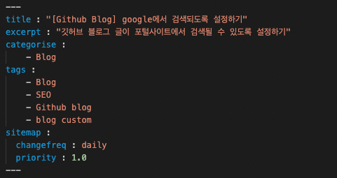

github blog 글이 포털에 검색되도록 설정하려면 각 포탈에 블로그를 등록해주어야 합니다.  
google에서 글이 검색이 가능하도록 등록해보겠습니다.  

## Github Blog 글이 google에 검색되도록 설정하기

### 1. sitemap 설정
sitemap을 google에 등록함으로써 주기적인 크롤링을 통해 url을 연결할 수 있습니다. sitemap을 만들어보겠습니다.  
블로그의 root 경로(github.io 폴더)에 ```/sitemap.xml``` 파일을 만들고 아래의 내용을 복사해서 붙여넣습니다.  
```

---
layout: null
---
<?xml version="1.0" encoding="UTF-8"?>
<urlset xmlns:xsi="http://www.w3.org/2001/XMLSchema-instance" xsi:schemaLocation="http://www.sitemaps.org/schemas/sitemap/0.9 http://www.sitemaps.org/schemas/sitemap/0.9/sitemap.xsd" xmlns="http://www.sitemaps.org/schemas/sitemap/0.9">
  
    <url>
      <loc>{{ site.url }}{{ post.url }}</loc>
      
        <lastmod>{{ post.date | date_to_xmlschema }}</lastmod>
      
        <lastmod>{{ post.lastmod | date_to_xmlschema }}</lastmod>
      

      
        <changefreq>weekly</changefreq>
      
        <changefreq>{{ post.sitemap.changefreq }}</changefreq>
      

      
          <priority>0.5</priority>
      
        <priority>{{ post.sitemap.priority }}</priority>
      

    </url>
  
</urlset>

```
다음 파일을 git commit으로 push 후에 ```"blog_url"/sitemap.xml``` 로 접속했을 때 아래와 같은 화면이 나와야 정상적으로 sitemap이 등록된 것입니다.  
  
  
sitemap에서는 해당 글의 정보들이 설정이 되는데 이것은 각 포스트의 맨 윗 부분에 다음과 같이 sitemap 옵션을 추가해줌으로서 추가적으로 설정할 수 있습니다.  
```
---
layout: post
title:  "제목"
date:   2022-04-23 12:00:00 
lastmod : 2022-04-24 12:00:00
sitemap :
  changefreq : daily
  priority : 1.0
---
```
포스트의 시작 부분에 다음과 같이 sitemap 코드를 적용해보겠습니다.  
  
  
  
git push 한 후에 다시 ```"blog_url"/sitemap.xml```로 접속하여 확인해보겠습니다.  
  
  
  
위 사진이 ```sitemap``` 지정 전, 아래 사진이 지정 후 사진입니다.  
<span style='background-color: #ffdce0'>sitemap을 설정해준 부분</span>은 ```changefreq```가 daily로 바뀌고, ```priority```는 1.0으로 잘 바뀌었습니다. 
반면 <span style='background-color: #f1f8ff'>sitemap을 설정 안 한 포스트</span>는 default값 그대로임을 확인할 수 있습니다.  
  
  

### 2. robots.txt 생성
```robots.txt``` 파일에 sitemap.xml 파일의 위치를 등록해두면 검색 엔진의 크롤러들이 홈페이지를 크롤링하는 데에 도움이 된다고 합니다. 
따라서 root 디렉토리```github.io/```에 ```robots.txt``` 파일을 만들고 다음과 같이 입력합니다.    
```
User-agent: *
Allow: /

Sitemap: http://"blog_url".github.io/sitemap.xml
```
  
### 3. 검색 엔진에 등록하기
google search console에 등록을 해야 최종적으로 검색 엔진에 블로그 포스트가 뜨게 됩니다.  
[google search console site](https://developers.google.com/search#?modal_active=none)에 접속한 후 시작하기 버튼을 누릅니다.  
  
  
  
위 화면에서 ```URL prefix```에 블로그 url을 붙여넣습니다. 
여기서 Domain, URL prefix 등록의 차이점은 도메인 속성은 DNS 레코드만을 사용해서 verify할 수 있으나 모든 하위 도메인의 데이터를 포함한 웹사이트의 정보를 모두 얻을 수 있습니다.  
URL perfix 등록은 입력한 속성과 하위 도메인의 레벨만 포함되기 때문에, https://yhp2205.github.io/를 등록했다면 https://yhp2205.github.io/First-post/ 같은 데이터는 포함이 되지만, 
http://yhp2205.github.io는 포함이 되지 않습니다. 대신 DNS와 달리 여러 경로로 사이트 소유 인증을 할 수 있습니다.  
저는 URL prefix를 이용하여 등록해보겠습니다.  
```Other verification methods```에서 HTML tag를 눌러 메타 태그를 copy합니다.  
  
  
  
이제 github blog의 root에 존재하는 ```_includes/head/custom.html``` 파일 맨 상단에 copy한 메타 태그를 붙여넣어 github에 push 해주었습니다.  
그리고 HTML tag를 copy한 페이지에서 verify를 눌러줍니다.  
  
  
  
그럼 ```Ownership verified``` 라는 문구가 뜨며 등록이 완료됩니다. 그럼 이제 마지막으로 sitemap을 올리기 위해 ```GO TO PROPERTY```를 누릅니다.  
  
  
  
  
  
마지막으로 google search console 창에서 sitemaps 카테고리를 눌러 ```sitemap.xml```을 submit 해주면 끝입니다.  
  


> 참고한 포스트  
[쉽게 하는 웹사이트 구글서치콘솔 등록](https://www.moinnet.com/ko/digital-marketing/google-search-console-add-property/)  
[github blog를 google에서 검색되도록 설정하기](http://jinyongjeong.github.io/2017/01/13/blog_make_searched/)