  
github blog에 giscus를 사용하여 댓글창을 만들어보겠습니다.  
보통 깃헙 블로그 댓글창으로는 disqus를 많이 사용하지만, 광고가 많고 무겁다는 평이 많아 비교적 가벼운 giscus를 적용해보려고 합니다.  

### 1. giscus 설치하기  
다음 [giscus](https://giscus.app/ko) 사이트에 접속합니다.  
<br/>
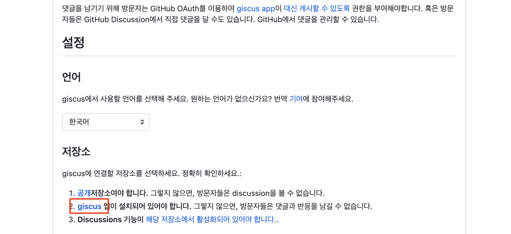  
<br/>
다음 giscus를 눌러 giscus 댓글창을 사용할 레포지토리에 install 합니다.  
<br/>
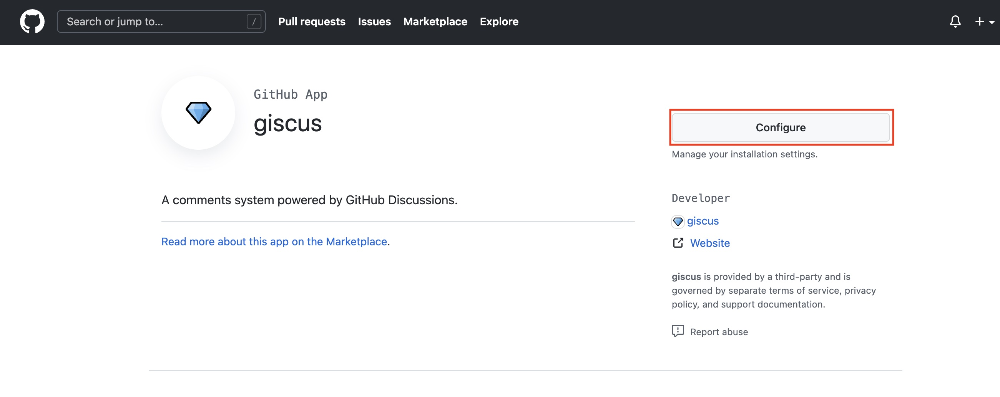  
<br/>
저는 이미 설치했기 때문에 configure이라고 뜨지만, 파란 install 버튼을 눌러줍니다.  
install 버튼을 누르면, ```all repositories```와 ```only select repositories``` 둘 중 선택하는 옵션이 있는데, ```only select repositories > 댓글창 적용할 repositories```선택하여 설치합니다.  

### 2. repository discussion 기능 활성화  
이제 giscus를 다운받은 repo의 discussion 기능을 활성화 시켜줘야 합니다.  
<br/>
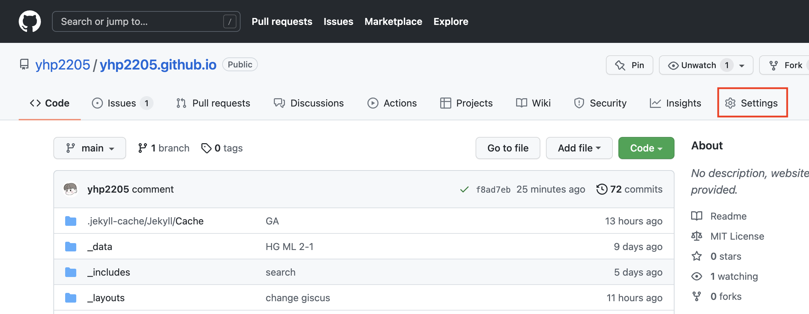  
<br/>
giscus를 다운받은 repo의 settings로 들어갑니다.  
<br/>
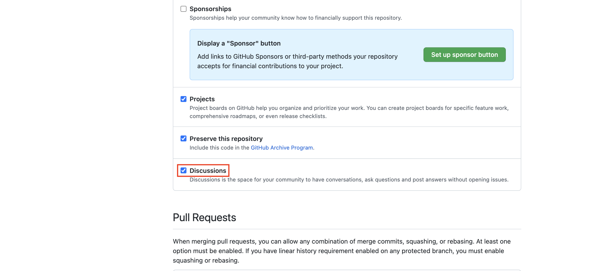  
<br/>
스크롤을 내려 ```Features/Discussions``` 를 활성화 시켜줍니다.  

### 3. giscus 코드 copy하기  
<br/>
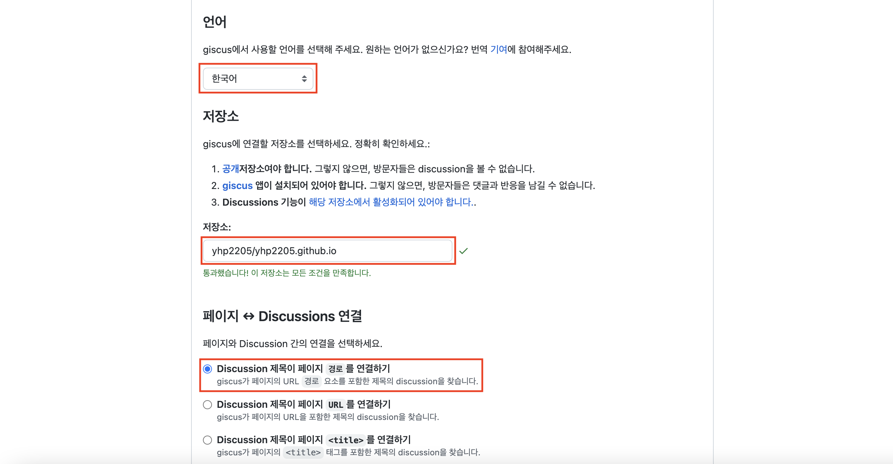  
<br/>
이제 다시 giscus 사이트로 돌아가 언어를 지정하고, giscus를 설치하고 discussions 기능을 활성화해준 repo의 이름을 적어줍니다.  
지금까지 정상적으로 진행되었다면 repo 입력란 주위에 통과했다는 메세지가 뜹니다.  
그리고 페이지와 discussion 간의 연결을 선택해줍니다.  
보통 title과 url보다 바뀔 가능성이 적은 경로로 연결하기 때문에 저도 그렇게 지정했습니다.  
<br/>
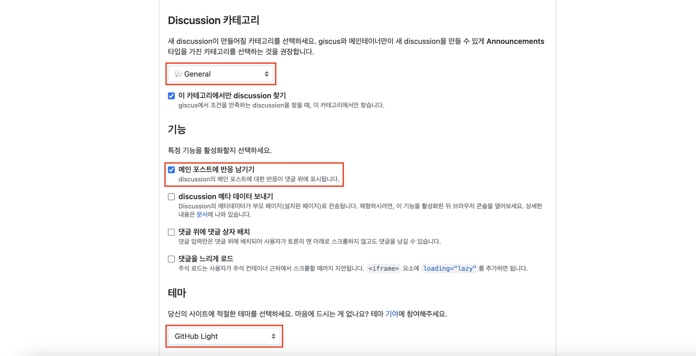  
<br/>
이제 discussion 카테고리를 지정해주고, 본인이 원하는 기능을 선택한 후에 쓰고있는 테마를 선택합니다.  
그럼 이제 giscus 활성화 아래 코드가 나타나는데, 코드를 copy하고 ```_layouts/posts.html``` 파일 마지막 부분에 붙여넣습니다.  
<br/>
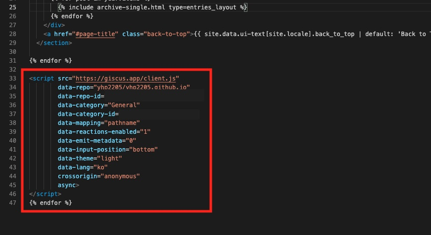  

### 4. config 파일에서 적용하기
제가 사용하는 minimal-mistakes 테마가 giscus를 지원하기 때문에 블로그의 _config.yml 파일에 comments를 지정하는 곳에 "giscus"를 입력하고 아래 giscus창에 앞선 코드를 참고하여 붙여넣어줍니다.  
<br/>
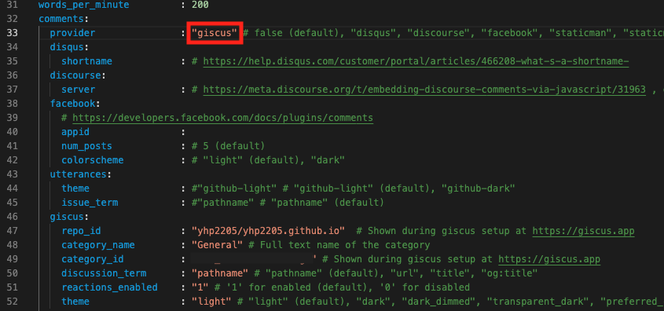  
<br/>
보통 이 정도의 과정을 거치면 댓글창이 적용이 되지만, 확인해보니 아직 적용이 되지 않은 것을 볼 수 있습니다.  
<br/>
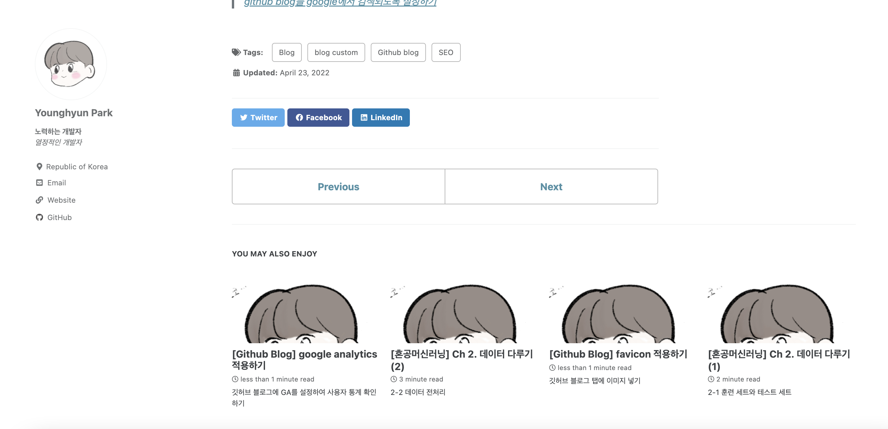  
<br/>
이럴 때는 다음과 같이 각 포스트의 title 과 tag 등을 지정하는 곳에 ```comments : "giscus"```를 지정해주고 push 해줍니다.  
<br/>
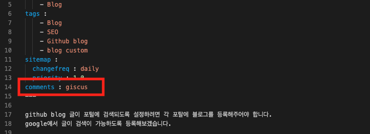  
<br/>
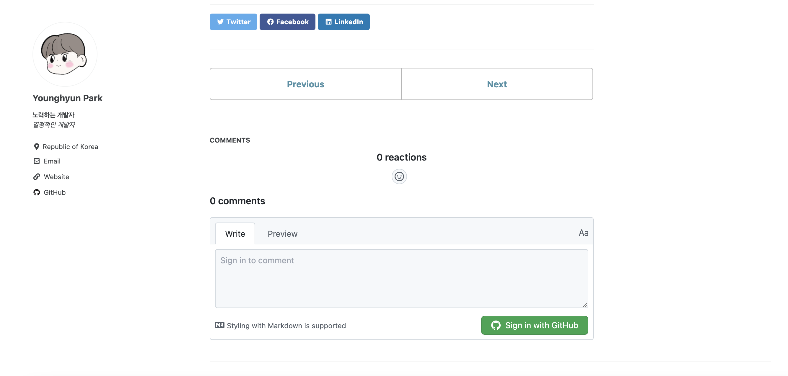  
<br/>
그리고 다시 확인해보면 위와 같이 comments 창이 제대로 뜨는 것을 확인할 수 있습니다. 
