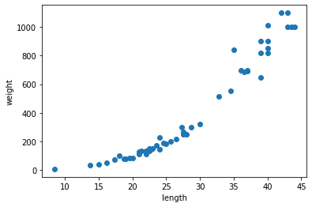

지도학습 알고리즘은 분류와 회귀로 나눌 수 있습니다.  
분류는 앞서 2장에서 했던 것처럼 클래스 중 하나로 분류하는 것이고, 회귀는 임의의 어떤 숫자를 예측하는 것입니다.  
  
k-최근접 이웃 분류는 앞서 진행했고, 이번에는 k-최근접 이웃 회귀를 알아보겠습니다.  
k-최근접 이웃 회귀는 예측하려는 샘플에 가장 가까운 샘플 k개를 선택하여 이웃 수치들의 평균을 구하는 방식입니다.  
<br/>  
회귀분석에 쓰일 데이터를 불러온 후 산점도를 그려보겠습니다.  

```python
#numpy import
import numpy as np

#Data load
perch_length = np.array([8.4, 13.7, 15.0, 16.2, 17.4, 18.0, 18.7, 19.0, 19.6, 20.0, 21.0,
       21.0, 21.0, 21.3, 22.0, 22.0, 22.0, 22.0, 22.0, 22.5, 22.5, 22.7,
       23.0, 23.5, 24.0, 24.0, 24.6, 25.0, 25.6, 26.5, 27.3, 27.5, 27.5,
       27.5, 28.0, 28.7, 30.0, 32.8, 34.5, 35.0, 36.5, 36.0, 37.0, 37.0,
       39.0, 39.0, 39.0, 40.0, 40.0, 40.0, 40.0, 42.0, 43.0, 43.0, 43.5,
       44.0])
perch_weight = np.array([5.9, 32.0, 40.0, 51.5, 70.0, 100.0, 78.0, 80.0, 85.0, 85.0, 110.0,
       115.0, 125.0, 130.0, 120.0, 120.0, 130.0, 135.0, 110.0, 130.0,
       150.0, 145.0, 150.0, 170.0, 225.0, 145.0, 188.0, 180.0, 197.0,
       218.0, 300.0, 260.0, 265.0, 250.0, 250.0, 300.0, 320.0, 514.0,
       556.0, 840.0, 685.0, 700.0, 700.0, 690.0, 900.0, 650.0, 820.0,
       850.0, 900.0, 1015.0, 820.0, 1100.0, 1000.0, 1100.0, 1000.0,
       1000.0])

#산점도 그리기
import matplotlib.pyplot as plt
plt.scatter(perch_length, perch_weight)
plt.xlabel('length')
plt.ylabel('weight')
plt.show()
```
  
<br/>
다음과 같이 우상향하는 그래프가 출력되었습니다.  
농어 길이가 늘어날 수록 무게도 늘어나는 것은 확인했습니다.  
다음으로 데이터를 훈련 세트와 테스트 세트로 나눕니다.  

```python
from sklearn.model_selection import train_test_split
train_input, test_input, train_target, test_target = train_test_split(
    perch_length, perch_weight, random_state = 42
)
```
train_test_split 메서드는 총 데이터의 25%를 test 데이터로 떼어냅니다.  
random_state는 책과 동일한 결과가 나올 수 있게 한 것이기 때문에 생략해도 무방합니다.  
사이킷런을 사용해 모델을 훈련할 것이기 때문에 reshape을 사용하여 배열을 2차원으로 바꿔줍니다.  

```python
train_input = train_input.reshape(-1, 1)
test_input = test_input.reshape(-1, 1)
print(train_input.shape, test_input.shape)
```
>(42, 1) (14, 1)  

reshape의 첫 번째 인자를 -1로 지정함으로써 원소의 개수로 채우라는 의미입니다. 배열의 전체 원소의 개수를 외우지 않아도 되기 때문에 편리합니다.  
이제 k-최근접 이웃 알고리즘을 훈련시켜보도록 하겠습니다.
사이킷런에서 KNeighborsRegressor을 사용하여 회귀 모델을 fit 합니다.  

```python
from sklearn.neighbors import KNeighborsRegressor
knr = KNeighborsRegressor()

#k-최근접 이웃 회귀모델을 훈련합니다.
knr.fit(train_input, train_target)
print(knr.score(test_input, test_target))
```
>0.992809406101064

거의 1에 가까운 숫자가 나왔습니다.  
2장에서 분류를 할 때는 정확도라고 불렀던 이 숫자를 회귀에서는 결정계수라고 부릅니다. 결정계수가 1에 가까워지면 예측이 타깃과 비슷하다는 의미가 됩니다.  
아제 타깃과 예측한 값의 차이를 구해보겠습니다. sklearn.metrics 패키지의 mean_absolute_error을 이용하여 둘 사이의 절댓값 오차를 평균을 낸 값을 출력합니다.  
그리고 훈련 세트를 사용하여 score값도 출력해보도록 하겠습니다.  

```python
from sklearn.metrics import mean_absolute_error

#테스트 세트에 대한 예측
test_prediction = knr.predict(test_input)

#테스트 세트의 평균 절댓값 오차 계산
mae = mean_absolute_error(test_target, test_prediction)
print(mae)

print(knr.score(train_input, train_target))
```
>19.157142857142862  
>0.9698823289099254

위 코드를 출력하면 평균적으로 오차가 19g정도 났다는 것을 확인할 수 있습니다.  
또한 훈련을 한 세트로 score을 냈는데도 불구하고 오히려 test set보다 결정계수가 더 낮게 나온 것을 확인할 수 있습니다.  
이처럼 훈련 세트보다 테스트 세트가 점수가 높거나 두 점수 모두 낮은 경우를 과소적합이라고 하고, 반대로 너무 차이나게 훈련 세트가 점수가 높을 경우를 과대적합이라고 합니다. 이번 훈련에서는 과소적합이 된 것입니다.  그렇다면 모델을 더 복잡하게 만듦으로써 이를 해결해보도록 하겠습니다.  
모델을 복잡하게 만들기 위해 k를 3으로 줄입니다.  

```python
# 이웃의 개수를 3으로 설정
knr.n_neighbors = 3

# 모델 훈련
knr.fit(train_input, train_target)
print(knr.score(train_input, train_target))
```
>0.9804899950518966  

k값을 낮췄더니 결정계수의 값이 올라갔습니다. 이번엔 test 세트를 적용해봅니다.  

```python
print(knr.score(test_input, test_target))
```
>0.9746459963987609  

test set 또한 너무 낮지 않은 점수로 잘 나왔습니다.  
train set과 점수 차이도 많이 나지 않아 과대적합도 아닙니다. 이처럼 과소적합 시 모델을 더 복잡하게 (k값을 줄여서) 만들어야 하고, 과대적합 시 모델을 덜 복잡하게 (k값을 늘려서) 만듦으로써 해결할 수 있습니다.
