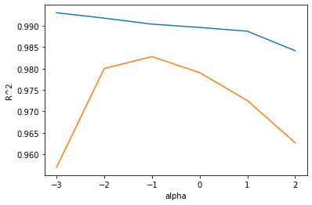
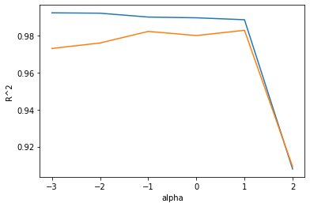

앞서 훈련했던 모델에서 훈련 세트보다 테스트 세트가 더 점수가 높게 나왔습니다.  
이 문제를 해결하기 위해 농어의 길이 뿐만 아니라 농어의 높이와 두께 등의 여러 특성들을 추가로 사용해보겠습니다.  
또한 이전에 사용했던 방법인 각 항을 제곱하여 데이터에 추가하는 것과 각 특성을 서로 곱해 새로운 특성을 만드는 방식을 사용합니다.  

```python
# data load
import pandas as pd
df = pd.read_csv('https://bit.ly/perch_csv')
perch_full = df.to_numpy()
print(perch_full)
```
>[[ 8.4   2.11  1.41]  
 [13.7   3.53  2.  ]  
 [15.    3.82  2.43]  
 [16.2   4.59  2.63]  
 [17.4   4.59  2.94]  
 [18.    5.22  3.32]  
...  

이번에는 데이터가 여러 특성이 있음을 고려하여 pandas를 이용해 직접 csv 데이터를 불러오는 방식을 사용했습니다.  
이제 이전과 동일한 방식으로 타깃 데이터를 준비하고, perch_full과 perch_weight를 훈련 세트와 테스트 세트로 나눕니다.  

```python
import numpy as np
perch_weight = np.array([5.9, 32.0, 40.0, 51.5, 70.0, 100.0, 78.0, 80.0, 85.0, 85.0, 110.0,
       115.0, 125.0, 130.0, 120.0, 120.0, 130.0, 135.0, 110.0, 130.0,
       150.0, 145.0, 150.0, 170.0, 225.0, 145.0, 188.0, 180.0, 197.0,
       218.0, 300.0, 260.0, 265.0, 250.0, 250.0, 300.0, 320.0, 514.0,
       556.0, 840.0, 685.0, 700.0, 700.0, 690.0, 900.0, 650.0, 820.0,
       850.0, 900.0, 1015.0, 820.0, 1100.0, 1000.0, 1100.0, 1000.0,
       1000.0])

from sklearn.model_selection import train_test_split
train_input, test_input, train_target, test_target = train_test_split(perch_full, perch_weight, random_state = 42)
```

사이킷런의 sklearn.preprocessing 패키지의 PolynomialFeatures 클래스를 사용해서 새로운 특성을 만들어 보겠습니다.  
PolynomialFeatures 클래스는 기본적으로 각 특성을 제곱한 항을 추가하고 특성끼리 서로 곱한 항을 추가합니다.  
이때 기본적으로 1을 추가하여 각 특성에 곱함으로써 절편을 만드는데, 사이킷런 선형 모델은 자동으로 절편이 들어가있기 때문에 include_bias=False 인자를 추가함으로서 절편을 위한 항을 제거할 수 있습니다.  

```python
from sklearn.preprocessing import PolynomialFeatures

# train_input을 변환하여 train_poly 만들기
poly = PolynomialFeatures(include_bias=False)
poly.fit(train_input)
train_poly = poly.transform(train_input)
print(train_poly.shape)
```
>(42, 9)  

PolynomialFeatures 클래스는 9개의 특성이 어떻게 반영되어있는지 확인하는 방법을 제공합니다.  
get_feature_names() 메서드를 사용하여 알 수 있습니다.  

```python
poly.get_feature_names()
```
>['x0', 'x1', 'x2', 'x0^2', 'x0 x1', 'x0 x2', 'x1^2', 'x1 x2', 'x2^2']  

```python
#test set 변환하기
test_poly = poly.transform(test_input)

#다중회귀 모델 훈련하기
from sklearn.linear_model import LinearRegression
lr = LinearRegression()
lr.fit(train_poly, train_target)
print(lr.score(train_poly, train_target))
```
>0.9903183436982124  

train set을 이용하여 점수를 내보았으니 test set도 점수를 출력해보겠습니다.  

```python
#test set 점수도 확인하기
print(lr.score(test_poly, test_target))
```
>0.9714559911594134  

테스트 세트 점수와 훈련세트 점수 모두 높게 나오면서 train 세트가 더 점수가 높게 나온 것을 확인할 수 있습니다.  
이제 특성을 더 많이 추가해보겠습니다.  
PolynomialFeatures 클래스의 degree 변수를 사용하면 고차항의 최대 차수를 지정할 수 있습니다.  

```python
poly = PolynomialFeatures(degree = 5, include_bias = False)
poly.fit(train_input)
train_poly = poly.transform(train_input)
test_poly = poly.transform(test_input)
print(train_poly.shape)
```
>(42, 55)  

만들어진 특성의 개수가 55개인 것을 확인할 수 있습니다.  
train_poly 배열의 열의 개수가 특성의 개수라고 생각하면 됩니다.  
이제 transform을 마쳤으니 이 데이터로 다시 훈련해보도록 하겠습니다.  

```python
lr.fit(train_poly, train_target)
print(lr.score(train_poly, train_target))

print(lr.score(test_poly, test_target))
```
>0.9999999999991097  
>-144.40579242684848  

결과를 보면 train set에 대한 점수는 매우 높게 나오고, test set에 대한 점수는 음수가 나왔습니다.  
이는 특성의 개수를 크게 늘렸기 때문에 train set에 대해 과대적합된 결과로 볼 수 있습니다.  
이러한 과대적합을 줄이기 위해서는 선형 회귀 모델의 계수를 규제하여 해결해보겠습니다.  

```python
from sklearn.preprocessing import StandardScaler
ss = StandardScaler()
ss.fit(train_poly)
train_scaled = ss.transform(train_poly)
test_scaled = ss.transform(test_poly)
```

선형 회귀 모델에 규제를 추가한 모델을 ridge와 lasso라고 부르는데, 릿지는 계수를 제곱한 값을 기준으로 규제를 적용하고, 라쏘는 계수의 절댓값을 기준으로 규제를 적용합니다.  
일반적으로는 릿지를 조금 더 선호하기 때문에 릿지 회귀를 먼저 훈련해보도록 하겠습니다.  

```python
from sklearn.linear_model import Ridge
ridge = Ridge()
ridge.fit(train_scaled, train_target)
print(ridge.score(train_scaled, train_target))

print(ridge.score(test_scaled, test_target))
```
>0.9896101671037343  
>0.9790693977615397  

ridge 모델을 사용하여 훈련한 결과 많은 특성을 사용했음에도 불구하고 훈련세트, 테스트 세트 모두에서 좋은 점수가 나왔습니다.  
릿지와 라쏘 모델을 적용할 때 모델 객체 중 alpha 값을 사용함으로써 규제의 정도를 정할 수 있는데,
alpha값이 크면 규제의 강도가 세기 때문에 과소적합될 가능성이 크고,
작으면 계수를 줄이는 역할이 줄어들고 선형 회귀 모델과 유사해지기 때문에 과대적합될 가능성이 큽니다.  
적절한 alpha 값을 찾기 위해서는 alpha 값에 대한 결정계수 값을 그려 훈련 세트와 테스트 세트의 점수가 가장 가까운 지점을 최적의 alpha 값으로 생각하면 됩니다.  
그럼 alpha값을 바꿀 때 마다 score 값을 저장할 리스트를 먼저 만들어주겠습니다.  

```python
import matplotlib.pyplot as plt
train_score = []
test_score = []

#alpha 값 리스트 생성
alpha_list = [0.001, 0.01, 0.1, 1, 10, 100]

for alpha in alpha_list :
  #ridge model 생성
  ridge = Ridge(alpha=alpha)
  #ridge model 훈련
  ridge.fit(train_scaled, train_target)
  #훈련 점수와 테스트 점수 저장
  train_score.append(ridge.score(train_scaled, train_target))
  test_score.append(ridge.score(test_scaled, test_target))
```
이제 alpha 값에 따른 그래프를 그려 값을 확인해보도록 하겠습니다.  
그냥 그리면 그래프 왼쪽이 너무 촘촘해지기 때문에 로그함수로 바꿔 표현합니다.  

```python
plt.plot(np.log10(alpha_list), train_score)
plt.plot(np.log10(alpha_list), test_score)
plt.xlabel('alpha')
plt.ylabel('R^2')
plt.show()
```
  
<br/>
다음 그래프를 확인해보면, 적절한 alpha 값이 -1, 즉 0.1 이라는 것을 알 수 있습니다.  
alpha 값을 0.1로 지정하여 모델을 훈련하겠습니다.  

```python
ridge = Ridge(alpha = 0.1)
ridge.fit(train_scaled, train_target)
print(ridge.score(train_scaled, train_target))
print(ridge.score(test_scaled, test_target))
```
>0.9903815817570366  
>0.9827976465386926  

train값이 test값보다 높게 나오면서 두 점수 모두 적절한 점수가 나온것을 확인할 수 있습니다.  
이제 lasso 회귀모델을 훈련해보도록 하겠습니다.  

```python
train_score = []
test_score = []
alpha_list = [0.001, 0.01, 0.1, 1, 10, 100]
for alpha in alpha_list:
  # lasso model을 만들기
  lasso = Lasso(alpha=alpha, max_iter = 10000)
  # lasso model 훈련하기
  lasso.fit(train_scaled, train_target)
  # train set와 test set score을 저장
  train_score.append(lasso.score(train_scaled, train_target))
  test_score.append(lasso.score(test_scaled, test_target))

#x축을 로그스케일로 바꿔 그래프 그리기
plt.plot(np.log10(alpha_list), train_score)
plt.plot(np.log10(alpha_list), test_score)
plt.xlabel('alpha')
plt.ylabel('R^2')
plt.show()
```
  
<br/>
위 그래프를 확인했을 때 올바른 alpha값은 1이라는것을 알 수 있습니다.  
이 값으로 lasso 모델을 훈련합니다.  

```python
lasso = Lasso(alpha = 10)
lasso.fit(train_scaled, train_target)
print(lasso.score(train_scaled, train_target))
print(lasso.score(test_scaled, test_target))
```
>0.9888067471131867  
>0.9824470598706695  

lasso 모델은 계수값을 0으로 만들 수 있습니다.  
라쏘모델의 계수중 0인것의 개수를 출력해보겠습니다.  

```python
print(np.sum(lasso.coef_ == 0))
```
>40  

계수가 0인 항이 40개인 것을 확인할 수 있습니다.  
총 55개의 특성 중 15개만 사용한 것입니다.  
이런 특성이 있기 때문에 라쏘 모델을 유용한 특성을 골라내는 데에 사용하기도 합니다.  
릿지와 라쏘 회귀를 사용하여 최적의 alpha 값을 찾아보고 특성이 많은 데이터를 규제하여 모델의 성능을 확인해봤습니다.  